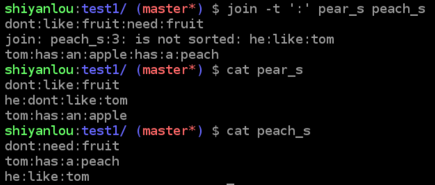
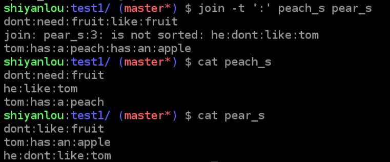
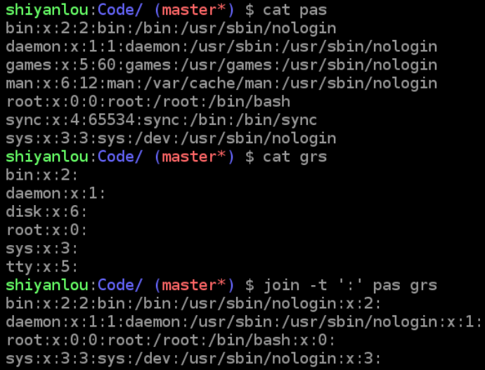

##### 引子 本节课是上节课实现管道操作命令的延申，故将结合管道命令来学习

### 文本处理命令
- `tr`命令：删除或转换一段文本信息中的某些文字
  - 格式`tr [option] ... SET1 [SET2]`
  - options
    |选项|说明|
    |-|-|
    |`-d`|删除和SET1匹配的字符，注意不是全词匹配也不是按字符顺序匹配|
    |`-s`|去除SET1指定的在输入文本连续块中重复部分的字符|
  - 操作举例
    - eg.`echo 'hello shiyanlou' | tr -d 'olh'`删除“hello shiyanlou”中所有的o，l，h
    - eg.`echo 'hello' | tr -s 'l'`将“hello”中的l去重为一个l
    - eg.`input some text here | tr '[:lower:]' '[:upper]'`将输入的文本全部转换为大写输出（根据，u顺序决定）。  
      注：'[:lower:]' '[:upper:]'你也可以简单的写作'[a-z]' '[A-Z]'

- `col`命令：将Tab替换成对等数量的空格键，或反转这个操作
  - 格式`col [option]`
  - options
    |选项|说明|
    |-|-|
    |`-x`|将Tab转换为空格且自动判断空格数量|
    |`-h`|将空格转换为Tab（默认）|
  -操作举例
    - `cat -A /etc/protocols`查看文件中的不可见字符，其中`^I`为Tab转义为可见字符后的符号
    - `cat /etc/protocols | col -x | cat -A`发现`^I`消失
  - 补充：在`-A`参数中，`Tab`转义为`^I`；断行字元转义为`$`(Windows下为`^M$`)；空格键不转义

- `join`命令：将两个文件中包含相同内容的一行合并在一起（数据库常见操作）
  - 格式`join [option] ... file1 file2`
  - options
    |选项|说明|
    |-|-|
    |`-t`|指定分隔符，空格默认|
    |`-i`|忽略大小写的差异|
    |`-1`|指明第一个文件要用哪个字段来对比，默认对比第一个字段|
    |`-2`|指明第二个文件要用哪个字段来对比，默认对比第一个字段|
  - 操作举例
    - 显然这里对join的参数有顺序
      ```
      $ echo '1 hello' > file1
      $ echo '1 shiyanlou' > file2
      $ join file1 file2
      1 hello shiyanlou
      ```
    - 从行头开始检索并合并不重复的一部分？？？
      ```
      $ cat pear
      tom:has:an:apple
      tom:has:an:apple:with:juice
      jack:dont:like:which:other:likes

      $ cat peach
      tom:dont:has:an:apple
      maybe:tom:has:an:apple

      jack:dont:like:which:other:likes
      $ join -t ':' pear peach
      tom:has:an:apple:dont:has:an:apple
      tom:has:an:apple:with:juice:dont:has:an:apple
      join: peach:3: is not sorted:
      ```
      - 默认仅仅匹配第一个（或设置值）字符块，对于不存在第一个字符块的行自动省略  
      结合鸟哥给出的应用实例可以知道，本命令简单到只是

      -
      ```
      $ cat pear_s[16:18:20]
      dont:like:fruit
      tom:has:an:apple
      $ cat peach_s[16:18:25]
      dont:need:fruit
      he:like:tom
      tom:has:a:peach
      $ join -t ':' pear_s peach_s[16:18:28]
      dont:like:fruit:need:fruit
      tom:has:an:apple:has:a:peach
      ```
      - 可见join对顺序的要求并不存在以行为基准
      - 对比？
          
        
      - 注意两个参数的顺序会对形成的文件造成影响
      - 头一行一致的情况下能够做智能化的判断
        
      - 一旦使用参数指明用哪个字段来作比较，那么sort默认排序失效？？？
  - `paste`命令
    - 参数
      - `-s`不合并到一行，每个文件为一行
      - `-d 单引号字符串`指定合并的分隔符，默认为Tab

- 课堂小结：上面这些命令不是所有你都会经常用到，不过它们确是很实用的，熟练掌握之后，可以减轻很多工作量，比如不停的用鼠标操作在 gedit 里面复制粘贴复制粘贴，将两个文件的内容合并为一个文件，这原本只需要一个命令就能完成。
- 小游戏：基于ncurses命令行图形库·制作的ninvaders
### Learn for More
- 命令`join`仍然是一个问题（可能的话需要阅读源代码）
- echo 后面加单引号,双引号,不加符号,还有$分别是什么意思?
- 作业未完成
